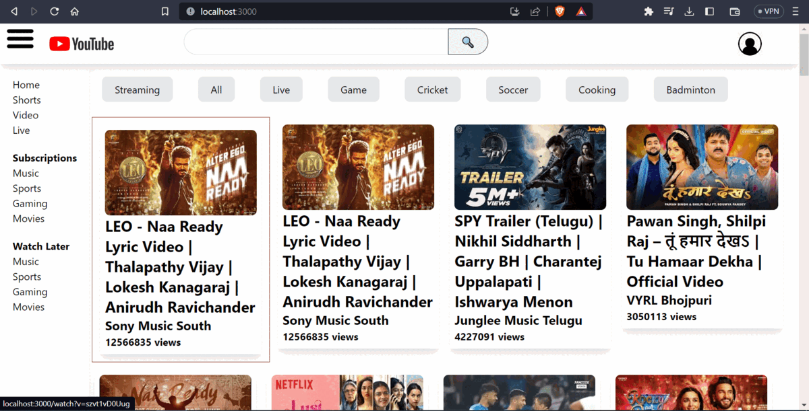

<h1>YouTube Clone Funtube</h1>
<h6>React Library has been used</h6>

<h2>Brief desciption of Project</h2>

- There is a user icon and a clickable Funtube icon which will take us to home page via routing.
- Video data is fetched from the YouTube API, which are publicly available and will be displayed on the screen.
- With the help of dynamic routing, we made the video cards clickable.
- For routing, we have used React Router DOM to move to different pages.
- For search, we have used the search API and the concept of Debouncing to show the search results as the user keeps typing.
- React Hooks like useEffect for API calls used.
- Shimmer has been added and lazy loading as well.
- We are having a Sidebar which will appear and can be hidden on clicking the hamburger icon. This is achieved by creating a slice in our store using the concept of React Redux.
- useState() is used in such cases, but to make our app scalable, we have used Redux.
- We have used TailwindCSS in our project as our focus is more on functionalities.